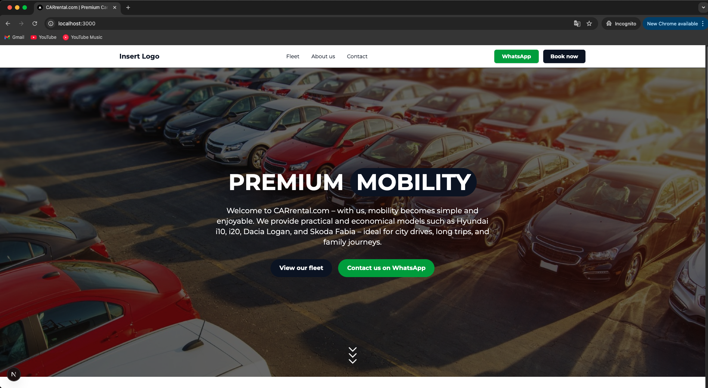
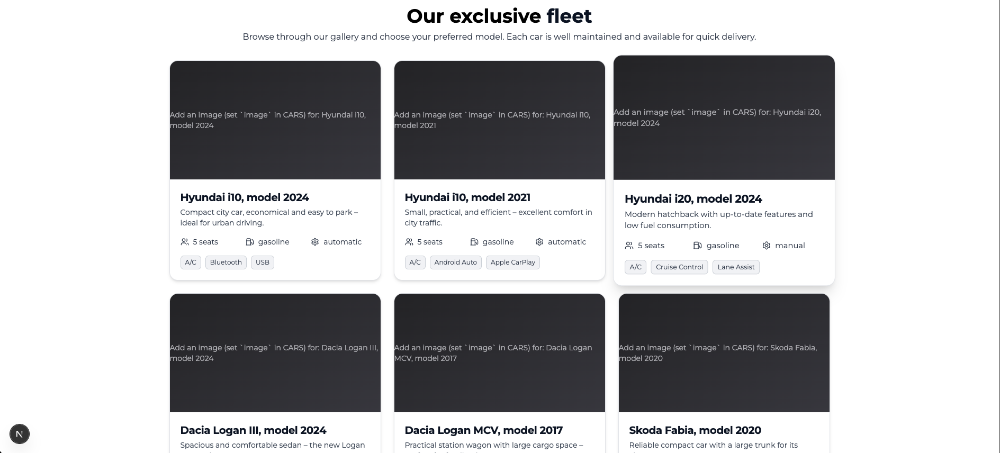
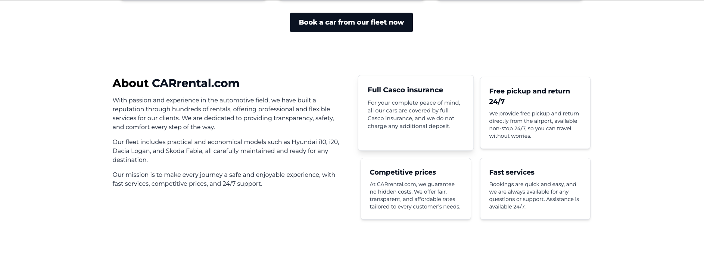

# 🚗 CARrental Template

<p align="center">
  
</p>

A modern, responsive **car rental website template** built with **Next.js 14**, **Tailwind CSS**, and **TypeScript**.  
Designed for car rental businesses — fully modular, SEO-optimized, and easy to customize.

---

## ✨ Features
- 🧱 Modular component structure (Hero, Fleet, Info, Contact, Locations)
- 🧭 SEO-ready (metadata, Open Graph, canonical URLs)
- ⚡ Built with Next.js 14 App Router
- 🖼️ Optimized design with Tailwind CSS
- 📜 Prebuilt legal pages (Cookies, Privacy, Terms)
- 🔍 Structured Data (JSON-LD) for Google indexing
- 💬 Fully commented template for developers

---

## 🖼️ Preview


### 🏠 Homepage


### 🚘 Fleet Section


### 🧾 Info Section


### ☎️ Contact Section


### 📍 Location Section


---

## ⚙️ Installation

Clone the repository and install dependencies:

```bash
git clone https://github.com/USERNAME/CARrental-template.git
cd CARrental-template
npm install
npm run dev
```

The app will run at [http://localhost:3000](http://localhost:3000)

---

## 🧩 Customization Guide

- Edit **Hero.tsx** → Update hero image, title, and CTA.
- Edit **Fleet.tsx** → Modify your car list and features.
- Edit **Info.tsx** → Adjust company highlights and advantages.
- Edit **Contact.tsx** → Replace phone, WhatsApp, and email info.
- Edit **Footer.tsx** → Add business address and links.

---

## 🧠 Tech Stack
- Next.js 15 (App Router)
- TypeScript
- Tailwind CSS
- Lucide React (icons)
- Firebase Ready (optional integration)

---

## 🧰 Deployment

You can deploy this template instantly with **Vercel**:

1. Push your project to GitHub.
2. Go to [vercel.com/new](https://vercel.com/new).
3. Import your repository and click **Deploy**.

---

## 🧭 Project Structure
```
src/app/
  ├── (main)/               → Main layout and homepage
  ├── politica-cookies/     → Cookies Policy layout and page
  ├── politica-de-confidentialitate/ → Privacy Policy layout and page
  ├── termeni-conditii/     → Terms & Conditions layout and page
  └── components/           → Reusable UI components (Hero, Fleet, Info, Contact, Locations)
```

---

## 📄 License

This template is open-source under the **MIT License** — feel free to use it in personal or commercial projects.

---

## 👨‍💻 Author
Developed by **EAA**  
For support or inquiries, reach out on GitHub.